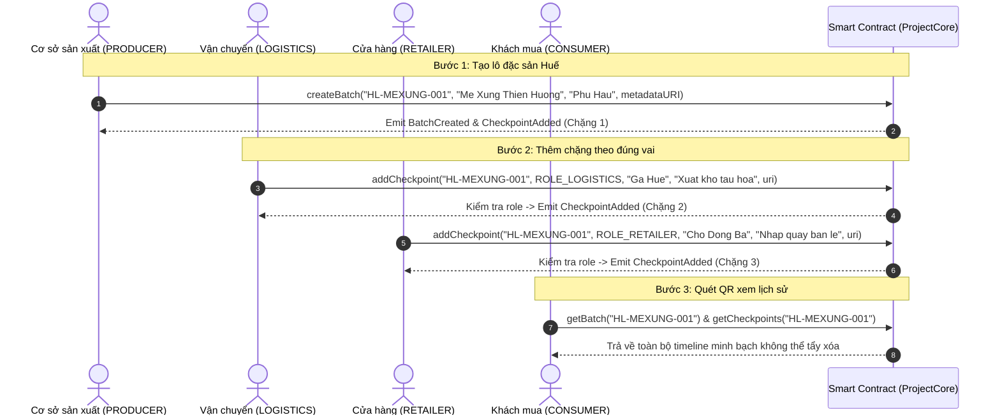

# SPEC — ĐẶC TẢ NGHIỆP VỤ HỆ THỐNG TRUY XUẤT ĐẶC SẢN HUẾ (HUELEGEND)

## 1. Mục tiêu sản phẩm
Hệ thống **HueLegend** ứng dụng công nghệ Blockchain (Ethereum Sepolia) nhằm giải quyết triệt để vấn đề hàng nhái, hàng giả mạo xuất xứ và mất uy tín thương hiệu đối với các sản phẩm đặc sản Huế (Mè xửng, Tôm chua, Trà sen, Tinh dầu tràm,...).
Hệ thống cung cấp cơ chế ghi chép hành trình bất biến on-chain:
- Giúp **Cơ sở sản xuất** minh bạch nguồn gốc nguyên liệu và chuẩn OCOP.
- Giúp **Đơn vị vận chuyển & Điểm bán** xác nhận việc tiếp nhận lô hàng bằng chữ ký mật mã (ví Web3).
- Giúp **Khách mua hàng** quét mã QR để đối soát toàn bộ chặng hành trình từ nông trại/xưởng sản xuất đến tay người tiêu dùng.

---

## 2. Các vai trò trong hệ thống (Actors & Roles)

| Vai trò | Ký hiệu on-chain | Trách nhiệm chính |
| :--- | :--- | :--- |
| **Quản trị viên hệ thống** | `ROLE_ADMIN` / `owner` | Cấp phát và thu hồi quyền vai trò cho các đơn vị tham gia mạng lưới. |
| **Cơ sở sản xuất** | `ROLE_PRODUCER` | Khởi tạo lô hàng đặc sản mới, ghi nhận vùng trồng/vùng đánh bắt nguyên liệu. |
| **Đơn vị vận chuyển** | `ROLE_LOGISTICS` | Cập nhật chặng nhận hàng, xuất kho, điều kiện vận chuyển (nhiệt độ, phương tiện). |
| **Đại lý / Cửa hàng bán lẻ** | `ROLE_RETAILER` | Ghi nhận chặng nhập kho cửa hàng tại Huế hoặc các tỉnh thành, niêm yết bán lẻ. |
| **Cơ quan kiểm định OCOP** | `ROLE_INSPECTOR` | Thẩm định chất lượng mẫu, cấp chứng nhận an toàn và đánh dấu xác thực (`isVerified`). |
| **Khách mua hàng** | Người dùng phổ thông (Guest) | Quét mã QR trên bao bì, đọc dữ liệu công khai trên blockchain mà không cần ví hay trả phí gas. |

---

## 3. Cấu trúc dữ liệu cốt lõi

### 3.1. Thực thể Lô hàng (`Batch`)
- `batchCode`: Mã lô định danh duy nhất (chuỗi ký tự, ví dụ: `HL-MEXUNG-2026-001`).
- `productName`: Tên sản phẩm đặc sản Huế (ví dụ: `Mè xửng giòn Thuận An`).
- `origin`: Địa danh xuất xứ nguyên liệu (ví dụ: `Phú Hậu, TP Huế`).
- `createdAt`: Dấu thời gian (Unix timestamp) tạo lô trên block.
- `producer`: Địa chỉ ví Ethereum của cơ sở sản xuất.
- `isVerified`: Trạng thái thẩm định chất lượng OCOP (`true`/`false`).
- `exists`: Cờ kiểm tra tính tồn tại của mã lô.

### 3.2. Thực thể Chặng hành trình (`Checkpoint`)
- `timestamp`: Thời điểm ghi nhận chặng on-chain.
- `recorder`: Địa chỉ ví thực hiện ký và gửi giao dịch.
- `role`: Vai trò của bên ghi nhận (`bytes32`).
- `location`: Địa điểm cụ thể diễn ra sự kiện (ví dụ: `Kho trung chuyển Ga Huế`).
- `action`: Nội dung hành động (ví dụ: `Niêm phong đóng thùng lạnh, xuất hàng đi Hà Nội`).
- `metadataURI`: Đường dẫn lưu trữ bằng chứng ngoại vi (IPFS hash hình ảnh, giấy kiểm nghiệm ATVSTP).

---

## 4. Luồng cốt lõi Demo (Core Workflow)

---

## 5. Quy tắc nghiệp vụ bắt buộc (Business Rules)

- **R1 (Tính độc nhất của lô hàng):** Mỗi `batchCode` chỉ được tạo đúng một lần duy nhất. Nếu gửi trùng sẽ lập tức báo lỗi `BatchAlreadyExists`.
- **R2 (Quyền khởi tạo):** Chỉ địa chỉ ví nắm giữ vai trò `ROLE_PRODUCER` (hoặc `owner`) mới được gọi hàm `createBatch`.
- **R3 (Khởi tạo chặng ban đầu):** Khi tạo lô thành công, hệ thống phải tự động tạo ngay Chặng 0 (Origin Checkpoint) mang thông tin xưởng sản xuất và thời gian tạo block.
- **R4 (Kiểm tra đúng vai khi thêm chặng):** Khi gọi `addCheckpoint`, ví gửi giao dịch (`msg.sender`) phải được cấp đúng vai trò `role` được khai báo trong tham số. Nếu không có quyền, giao dịch phải bị hủy bỏ với `revert UnauthorizedCaller(msg.sender, role)`.
- **R5 (Bất biến):** Lịch sử các chặng một khi đã ghi vào mảng `_batchCheckpoints` thì không có bất kỳ hàm nào cho phép sửa đổi hay xóa bỏ.
- **R6 (Xác thực chất lượng OCOP):** Chỉ ví có `ROLE_INSPECTOR` mới có thể gọi hàm `verifyBatch` để chuyển cờ `isVerified = true`.
- **R7 (Truy vấn tự do):** Mọi hàm đọc dữ liệu (`getBatch`, `getCheckpoints`, `getTotalBatches`) là hàm `view`, hoàn toàn miễn phí gas cho người tiêu dùng.
- **R8 (Phát sự kiện minh bạch):** Mọi thay đổi trạng thái (tạo lô, thêm chặng, chứng nhận OCOP, phân quyền) đều phải phát `event` tương ứng để phục vụ lắng nghe sự kiện trên DApp.

---

## 6. Xử lý ngoại lệ và Phòng chống gian lận

| Tình huống giả định | Hành vi hệ thống | Mã lỗi trả về |
| :--- | :--- | :--- |
| Kẻ xấu (ví bất kỳ) cố tình mạo danh đơn vị kiểm định để thêm tem giả | Hợp đồng kiểm tra `_roles[msg.sender][ROLE_INSPECTOR]` thất bại | Revert `UnauthorizedCaller` |
| Cơ sở sản xuất tạo mã lô rỗng `""` | Kiểm tra độ dài `bytes(batchCode).length == 0` | Revert `EmptyString("batchCode")` |
| Quét mã QR lô hàng không tồn tại trên chuỗi | Không tìm thấy trong mapping `_batches` | Revert `BatchNotFound` |
| Đơn vị vận chuyển cố tình ghi nhận chặng vào lô hàng chưa từng được tạo | Báo lỗi không tìm thấy lô hàng | Revert `BatchNotFound` |

---

## 7. Ngoài phạm vi (Out of Scope cho phiên bản Lab 8)
- Chưa tích hợp cảm biến IoT nhiệt độ tự động đẩy dữ liệu theo thời gian thực (hiện tại ghi nhận thủ công qua chữ ký ví Web3).
- Chưa quy đổi thanh toán tiền pháp định qua cổng ngân hàng (chỉ tương tác on-chain Sepolia).
