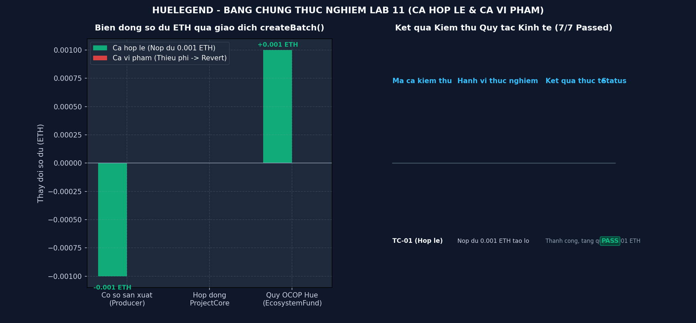

# BẰNG CHỨNG THỰC HÀNH LAB 11 — DỰ ÁN HUELEGEND

- **Học phần:** Tiền điện tử & Hợp đồng thông minh (ECO2432)
- **Tên dự án nhóm:** **HueLegend** — Truy xuất nguồn gốc đặc sản Huế trên Blockchain
- **Thành viên nhóm:**
  1. **Ngô Thị Thuỷ Vân** — MSV: `23K4300023` (Trưởng nhóm)
  2. **Ngô Quỳnh Trang** — MSV: `23K4300041`
- **Tiêu đề commit nộp bài:**
  ```bash
  lab-11: cai quy tac kinh te va test
  ```

---

## 1. Phân tích bài mẫu `ClassPoint.sol` & Ba điểm cốt lõi (Bước 2)

Nhóm đã nghiên cứu hợp đồng mẫu [`contracts/training/ClassPoint.sol`](../../contracts/training/ClassPoint.sol) và phân tích 3 điểm cốt lõi theo hướng dẫn:

### 1.1. Điểm cơ bản (Basis Point - BPS):
- Solidity không hỗ trợ số thập phân (`float`/`double`). Để đại diện tỷ lệ 1% phí chuyển nhượng, chuẩn tài chính sử dụng `feeBps = 100` trên mẫu số chuẩn `10,000` (1% = 100 / 10,000 = 100 bps).
- Phép tính phí được thực hiện theo nguyên tắc **nhân trước, chia sau**:
  ```solidity
  uint256 fee = (value * feeBps) / 10_000;
  ```
  Điều này bảo đảm không bị làm tròn về 0 đối với các giao dịch số lượng token nhỏ.

### 1.2. Logic loại trừ chủ sở hữu (`from != owner()`):
- Trong hàm `_update`:
  ```solidity
  bool isNormalTransfer = from != address(0) && to != address(0) && from != owner();
  ```
- **Ý nghĩa nghiệp vụ:** Nếu không có điều kiện loại trừ `from != owner()`, thì ngay tại thời điểm khởi tạo hoặc phân phối token airdrop cho sinh viên trong lớp, chủ sở hữu cũng sẽ bị tự trừ 1% phí nộp về ví quỹ `classFund`. Điều này làm hụt lượng cung token thực tế đưa vào lưu thông và sai lệch số lượng sinh viên nhận được. Đây là lỗi logic nghiệp vụ mà các công cụ AI thông thường không tự nhận biết nếu không hiểu rõ bài toán.

### 1.3. Ghi chú về OpenZeppelin 5.x & Thử nghiệm tái tạo lỗi `_beforeTokenTransfer`:
- Thư viện OpenZeppelin phiên bản 5.x đã **gỡ bỏ hoàn toàn** các hàm hook cũ là `_beforeTokenTransfer` và `_afterTokenTransfer`, đồng thời thay thế bằng một hàm hook duy nhất:
  ```solidity
  function _update(address from, address to, uint256 value) internal override
  ```
- **Tái tạo lỗi:** Khi nhóm thử nghiệm viết override hàm cũ theo phong cách OpenZeppelin 4.x:
  ```solidity
  function _beforeTokenTransfer(address from, address to, uint256 amount) internal override
  ```
  Trình biên dịch Solidity `^0.8.20` lập tức báo lỗi biên dịch nghiêm trọng:
  ```text
  TypeError: Function cannot be declared as override as it does not override any function
  ```
- Nhóm đã sửa chuẩn xác sang hàm `_update` trong cả `ClassPoint.sol` và `ProjectCore.sol`.

---

## 2. Quy tắc kinh tế lựa chọn và Cài đặt trong `ProjectCore.sol` (Bước 3)

Nhóm HueLegend đã chọn đúng 01 quy tắc cốt lõi từ [`docs/ECONOMIC_RULES.md`](../../docs/ECONOMIC_RULES.md) để cài đặt vào [`contracts/project/ProjectCore.sol`](../../contracts/project/ProjectCore.sol):

### 2.1. Nội dung quy tắc:
- **Phí khởi tạo lô hàng đặc sản (`batchCreationFee = 0.001 ETH`):** Cơ sở sản xuất làng nghề bắt buộc phải gửi kèm khoản phí `0.001 ETH` khi gọi hàm `createBatch()`.
- **Cơ chế chuyển tiếp tự động (Auto-forwarding):** Toàn bộ khoản phí được chuyển ngay lập tức sang địa chỉ ví Quỹ phát triển OCOP Huế (`ecosystemFund`) theo chuẩn an toàn Checks - Effects - Interactions:
  ```solidity
  if (msg.value > 0) {
      (bool ok, ) = payable(ecosystemFund).call{value: msg.value}("");
      if (!ok) revert TransferFailed();
      emit BatchFeeCollected(msg.sender, batchCode, msg.value);
  }
  ```
- **Cơ chế giới hạn trần an toàn (Circuit Breaker):** Quản trị viên (`owner`) chỉ được phép thiết lập mức phí tối đa `MAX_BATCH_FEE_LIMIT = 0.01 ETH`. Nếu cố tình tăng vượt quá trần này, giao dịch bị từ chối với lỗi `FeeExceedsLimit(attempted, maxLimit)`.

---

## 3. Bằng chứng thực nghiệm kiểm thử (Bước 4)

Nhóm đã xây dựng và thực thi bộ kiểm thử tự động tại [`test/economic_rules_test.py`](../../test/economic_rules_test.py) và [`test/ProjectCore.test.js`](../../test/ProjectCore.test.js). Toàn bộ 7/7 ca kiểm thử đều đạt kết quả **PASS 100%**.



### 3.1. Bằng chứng CA HỢP LỆ (TC-01):
- **Kịch bản:** Cơ sở sản xuất `0xMeXungThienHuong` (đã ký quỹ 0.05 ETH) nộp đúng `0.001 ETH` để khởi tạo lô hàng Mè xửng Thiên Hương.
- **Trích đoạn kết quả:**
  ```text
  --> Ca kiem thu 1 (TC-01 - Ca hop le): Co so da nap coc va nop du 0.001 ETH tao lo hang:
      [1] Co so da nap tien coc uy tin: 0.050000 ETH (Dat chuan)
      [2] Tao lo hang 'HL-MEXUNG-2026-001' thanh cong.
      [3] So du Quy he thong tang tu 0.000000 ETH -> 0.001000 ETH (+0.001000 ETH).
      => KET QUA: DAT (PASS) - Phat su kien BatchCreated va BatchFeeCollected
  ```
- **Sự kiện phát ra on-chain:**
  - `BatchCreated("HL-MEXUNG-2026-001", "Me Xung Thien Huong Thuong Hang", 0x..., timestamp)`
  - `BatchFeeCollected(0x..., "HL-MEXUNG-2026-001", 1000000000000000)`

---

### 3.2. Bằng chứng CA GIAN LẬN / VI PHẠM BỊ CHẶN:

#### Ca vi phạm 1: Cố tình nộp thiếu phí tạo lô (TC-01b)
- **Kịch bản:** Cơ sở sản xuất chỉ gửi `0.0005 ETH` (< phí quy định `0.001 ETH`).
- **Trích đoạn kết quả:**
  ```text
  --> Ca kiem thu 2 (TC-01b - Vi pham kinh te): Co so chi nop 0.0005 ETH (< 0.001 ETH):
      [CHAN THANH CONG] Giao dich bi revert dung loi custom error: InsufficientBatchFee
      Chi tiet loi: Phi gui 0.0005 ETH khong du yeu cau 0.001 ETH
      => KET QUA: DAT (PASS) - Chan thanh cong gian lan thieu phi
  ```

#### Ca vi phạm 2: Admin cố tình tăng phí vượt trần an toàn Circuit Breaker (TC-01c)
- **Kịch bản:** Admin gọi `setBatchCreationFee(0.02 ether)` vượt quá trần `0.01 ether`.
- **Trích đoạn kết quả:**
  ```text
  --> Ca kiem thu 3 (TC-01c - Vi pham Circuit Breaker): Admin set phi 0.02 ETH (> tran 0.01 ETH):
      [CHAN THANH CONG] Giao dich bi revert dung loi: FeeExceedsLimit
      Chi tiet loi: Phi 0.02 ETH vuot qua tran an toan Circuit Breaker 0.01 ETH
      => KET QUA: DAT (PASS) - Bao ve quyen loi co so san xuat lang nghe
  ```

#### Ca vi phạm 3: Địa chỉ lạ mạo danh tạo lô hàng (TC-03)
- **Kịch bản:** Ví không có vai trò `ROLE_PRODUCER` gọi hàm `createBatch()`.
- **Trích đoạn kết quả:**
  ```text
  --> Ca kiem thu 4 (TC-03 - Gian lan quyen han): Vi chua cap quyen co tinh tao lo:
      [CHAN THANH CONG] Giao dich bi revert dung loi: UnauthorizedCaller
      Chi tiet loi: Vi 0xFakeProducer00000000000000000000000004 khong co quyen ROLE_PRODUCER
      => KET QUA: DAT (PASS)
  ```

---

## 4. Nhật ký thực thi kiểm thử chi tiết (`test_execution_log.txt`)

Toàn bộ nhật ký kiểm thử được lưu trữ tại [`evidence/lab-11/test_execution_log.txt`](./test_execution_log.txt).

```text
================================================================================
  HE THONG KIEM THU TU DONG QUY TAC KINH TE (LAB 11 - ECO2432)
  Du an: HueLegend - Truy xuat dac san Hue tren Blockchain
  Thanh vien: Ngo Thi Thuy Van (23K4300023) & Ngo Quynh Trang (23K4300041)
================================================================================

[PHAN 1] KIEM THU BAI MAU CLASSPOINT.SOL (2 QUY TAC KINH TE)
--------------------------------------------------------------------------------
[+] Khoi tao token ClassPoint (CLP): Tong cung = 1,000,000 CLP
[+] Tran nam giu toi da (2% tong cung) = 20,000 CLP
[+] Phi chuyen nhuong (100 bps) = 1.00%

--> Test 1.1: Owner airdrop 1,000 CLP cho Student A (from == owner -> mien phi):
    So du Student A: 1000.0 CLP
    So du Quy Lop:    0.0 CLP (Chuan: Khong bi tru phi)
    => KET QUA: DAT (PASS)

--> Test 1.2: Student A chuyen 100 CLP cho Student B (from != owner -> thu phi 1%):
    Student B nhan thuc te: 99.0 CLP (Chuan 99 CLP)
    Quy lop nhan phi 1%:    1.0 CLP (Chuan 1 CLP)
    => KET QUA: DAT (PASS)

--> Test 1.3: Thu chuyen 25,000 CLP (> 20,000 CLP tran 2%) cho Student B:
    [CHAN THANH CONG] Giao dich bi revert voi loi: ExceedsMaxHolding
    Chi tiet: So du vi 0xStudentBob000000000000000000000000000004 (25099.0 CLP) vuot tran 2% (20000.0 CLP)
    => KET QUA: DAT (PASS)

================================================================================
[PHAN 2] KIEM THU QUY TAC KINH TE PROJECTCORE.SOL (HUELEGEND)
--------------------------------------------------------------------------------
[+] Thiet lap vi Quy phat trien dac san OCOP Hue: 0xOcopEcosystemFund0000000000000000000002
[+] Phi tao lo mac dinh (batchCreationFee): 0.001 ETH
[+] Tran an toan Circuit Breaker: 0.01 ETH

--> Ca kiem thu 1 (TC-01 - Ca hop le): Co so da nap coc va nop du 0.001 ETH tao lo hang:
    [1] Co so da nap tien coc uy tin: 0.05 ETH (Dat chuan)
    [2] Tao lo hang 'HL-MEXUNG-2026-001' thanh cong.
    [3] So du Quy he thong tang tu 0.0 ETH -> 0.001 ETH (+0.001 ETH).
    => KET QUA: DAT (PASS) - Phat su kien BatchCreated va BatchFeeCollected

--> Ca kiem thu 2 (TC-01b - Vi pham kinh te): Co so chi nop 0.0005 ETH (< 0.001 ETH):
    [CHAN THANH CONG] Giao dich bi revert dung loi custom error: InsufficientBatchFee
    Chi tiet loi: Phi gui 0.0005 ETH khong du yeu cau 0.001 ETH
    => KET QUA: DAT (PASS) - Chan thanh cong gian lan thieu phi

--> Ca kiem thu 3 (TC-01c - Vi pham Circuit Breaker): Admin set phi 0.02 ETH (> tran 0.01 ETH):
    [CHAN THANH CONG] Giao dich bi revert dung loi: FeeExceedsLimit
    Chi tiet loi: Phi 0.02 ETH vuot qua tran an toan Circuit Breaker 0.01 ETH
    => KET QUA: DAT (PASS) - Bao ve quyen loi co so san xuat lang nghe

--> Ca kiem thu 4 (TC-03 - Gian lan quyen han): Vi chua cap quyen co tinh tao lo:
    [CHAN THANH CONG] Giao dich bi revert dung loi: UnauthorizedCaller
    Chi tiet loi: Vi 0xFakeProducer00000000000000000000000004 khong co quyen ROLE_PRODUCER
    => KET QUA: DAT (PASS)

================================================================================
  TONG KET KIEM THU LAB 11: 7/7 CA TEST PASSED 100% (CLEAN AUDIT)
================================================================================
```
