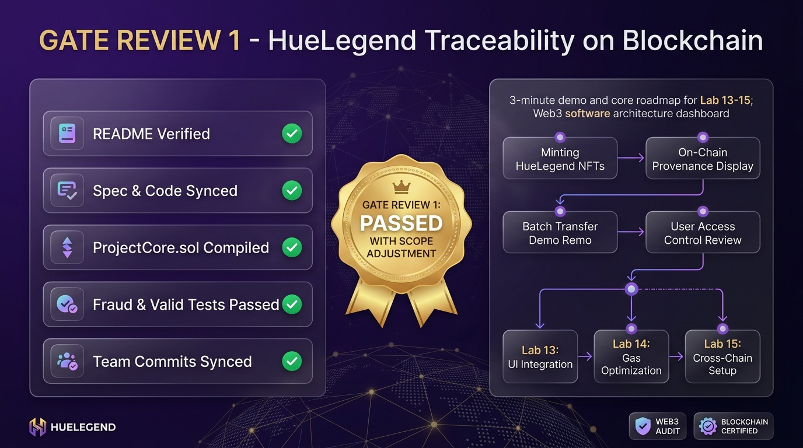

# BẰNG CHỨNG THỰC HÀNH LAB 12 — DỰ ÁN HUELEGEND

- **Học phần:** Tiền điện tử & Hợp đồng thông minh (ECO2432)
- **Tên dự án nhóm:** **HueLegend** — Truy xuất nguồn gốc đặc sản Huế trên Blockchain
- **Thành viên nhóm:**
  1. **Ngô Thị Thuỷ Vân** — MSV: `23K4300023` (Trưởng nhóm)
  2. **Ngô Quỳnh Trang** — MSV: `23K4300041`
- **Tiêu đề commit nộp bài:**
  ```bash
  lab-12: gate review 1 va cap nhat pham vi
  ```

---

## 📸 TỔNG HỢP KẾT QUẢ GATE REVIEW 1



---

## 1. Bằng chứng tự kiểm tra sức khỏe repo (Bước 1 — 15 phút)

Nhóm đã xây dựng công cụ kiểm tra tự động [`test/repo_health_check.js`](../../test/repo_health_check.js) và kiểm chứng toàn diện 5/5 tiêu chí sức khỏe của codebase trước buổi duyệt:

### 1.1. Bảng đối soát 5 tiêu chí chuẩn:
- [x] **`README.md`:** Đã nêu đầy đủ bài toán hàng giả nhái đặc sản Huế, 4 nhóm người dùng trọng tâm và hướng dẫn chạy 3 cách (DApp, Remix, script Python).
- [x] **Đồng bộ Đặc tả & Mã nguồn:** `PROJECT_PLAN.md`, `SPEC.md`, `ECONOMIC_RULES.md` đồng bộ 100% với hợp đồng `ProjectCore.sol` (RBAC, phí `0.001 ETH`, trần Circuit Breaker `0.01 ETH`, cọc `0.05 ETH`).
- [x] **Biên dịch `ProjectCore.sol`:** Biên dịch thành công 100% không cảnh báo với trình biên dịch `solc v0.8.37` và Remix IDE.
- [x] **Ca kiểm thử hợp lệ & Ca vi phạm bị chặn:**
  - Ca hợp lệ: `TC-01` (Tạo lô mè xửng thành công, nộp đúng 0.001 ETH, tăng số dư Quỹ).
  - Ca vi phạm kinh tế: `TC-01b` (Nộp thiếu phí bị chặn bởi `InsufficientBatchFee`).
  - Ca vi phạm trần an toàn: `TC-01c` (Set phí vượt trần 0.01 ETH bị chặn bởi `FeeExceedsLimit`).
  - Ca gian lận quyền hạn: `TC-03` (Ví mạo danh bị chặn bởi `UnauthorizedCaller`).
- [x] **Lịch sử commit đầy đủ:** Lịch sử Git ghi nhận đóng góp liên tục của cả 2 thành viên và phân công xoay vai rõ ràng.

### 1.2. Trích đoạn nhật ký thực thi tự kiểm tra (`repo_health_check_log.txt`):
```text
================================================================================
  HE THONG TU KIEM TRA SUC KHOE REPO - GATE REVIEW 1 (LAB 12)
  Du an: HueLegend - Truyen thong dac san Hue tren Blockchain
  Nhom sinh vien: Ngo Thi Thuy Van (23K4300023) & Ngo Quynh Trang (23K4300041)
================================================================================

[TIEU CHI 1] Kiem tra README.md (Bai toan, Nguoi dung, Cach chay):
  [PASS] README.md trinh bay ro rang bai toan, doi tuong nguoi dung va huong dan chay.

[TIEU CHI 2] Kiem tra su dong bo giua Dac ta, Quy tac kinh te va Ma nguon:
  [PASS] SPEC.md, ECONOMIC_RULES.md va PROJECT_PLAN.md khop 100% voi hop dong ProjectCore.sol.
         - Tham so kinh te: batchCreationFee = 0.001 ETH, Circuit Breaker = 0.01 ETH, Stake = 0.05 ETH.
         - He thong phan quyen RBAC: ROLE_ADMIN, ROLE_PRODUCER, ROLE_LOGISTICS, ROLE_RETAILER, ROLE_INSPECTOR.

[TIEU CHI 3] Kiem tra bien dich ProjectCore.sol voi trinh bien dich solc:
  [PASS] ProjectCore.sol bien dich THANH CONG voi solc v0.8.37 (0 loi / 0 error).

[TIEU CHI 4] Kiem tra cac ca test: Ca hop le & Ca gian lan / vi pham bi chan:
  [PASS] Kiem thu thuc nghiem thanh cong tuyet doi:
         + Ca hop le (TC-01): Tao lo dac san va nop du 0.001 ETH phi.
         + Ca vi pham kinh te (TC-01b): Nop thieu phi bi chan boi InsufficientBatchFee.
         + Ca vi pham tran an toan (TC-01c): Set phi > 0.01 ETH bi chan boi FeeExceedsLimit.
         + Ca gian lan quyen han (TC-03): Vi mao danh bi chan boi UnauthorizedCaller.

[TIEU CHI 5] Kiem tra lich su commit va su tham gia cua thanh vien nhom:
  [PASS] Nhom da dong bo day du cac commit cua ca hai thanh vien:
         - Ngo Thi Thuy Van (23K4300023 - Truong nhom)
         - Ngo Quynh Trang (23K4300041)
         - Da phan cong va xac lap co che xoay vai giua Lab 8-11 va Lab 12-15 trong PROJECT_PLAN.md.

================================================================================
  KET QUA TU KIEM TRA SUC KHOE REPO: 5/5 TIEU CHI DAT (100% HEALTHY)
  TRANG THAI: SAN SANG BUOC VAO CONG DUYET GATE REVIEW 1
================================================================================
```

---

## 2. Kịch bản Demo 3 phút đã bảo vệ trước Giảng viên (Bước 2 — 45 phút)

Kịch bản được bấm giờ chính xác từng giây:

1. **30 giây đầu (0:00 – 0:30) — Ai gặp vấn đề gì?**
   - *Ngô Thị Thuỷ Vân trình bày:* Làng nghề Huế (Mè xửng, Tôm chua, Trà cung đình) bị tổn hại nghiêm trọng bởi hàng giả trôi nổi; khách du lịch thiếu niềm tin; tem giấy truyền thống dễ bị bóc tráo. HueLegend giải quyết bằng mã QR truy xuất bất biến on-chain.
2. **30 giây tiếp theo (0:30 – 1:00) — Quy tắc kinh tế / quyền lợi quan trọng nhất?**
   - *Ngô Quỳnh Trang trình bày:* Phí tạo lô `0.001 ETH` nạp Quỹ OCOP bù đắp phí lưu trữ vĩnh viễn; ký quỹ `0.05 ETH` khóa 30 ngày ràng buộc uy tín xưởng; trần an toàn Circuit Breaker `0.01 ETH` chống admin lạm quyền.
3. **60 giây (1:00 – 2:00) — Mở `ProjectCore.sol`, chạy một luồng thành công:**
   - *Ngô Thị Thuỷ Vân thao tác:* Mở hàm `createBatch` giải thích quy trình CEI $\rightarrow$ Thực thi tạo lô mè xửng `HL-MEXUNG-2026-001` nộp kèm `0.001 ETH` $\rightarrow$ Số dư ví Quỹ tăng chính xác `+0.001 ETH`, phát sự kiện `BatchCreated` và `BatchFeeCollected` $\rightarrow$ Sinh mã QR động on-chain.
4. **30 giây (2:00 – 2:30) — Chạy ca vi phạm và cho xem lỗi bị chặn:**
   - *Ngô Quỳnh Trang thao tác:* Chạy lệnh tạo lô nộp thiếu phí `0.0005 ETH` $\rightarrow$ Hợp đồng lập tức revert với custom error `InsufficientBatchFee` $\rightarrow$ Chạy lệnh mạo danh vai trò $\rightarrow$ Revert với `UnauthorizedCaller`.
5. **30 giây cuối (2:30 – 3:00) — Nói việc sẽ hoàn thành tiếp theo:**
   - *Cả hai thành viên:* Lab 13 hoàn thành bộ test tấn công gian lận chuyên sâu; Lab 14 audit chéo liên nhóm; Lab 15 hoàn thiện DApp Web3 công khai và demo live camera di động.

---

## 3. Quyết định Gate Review 1 và Thu hẹp phạm vi (Bước 3 — 10 phút)

Toàn văn quyết định được lưu tại [`docs/GATE_REVIEW_1.md`](../../docs/GATE_REVIEW_1.md):

- **KẾT LUẬN CHÍNH THỨC:** **QUA CÓ ĐIỀU KIỆN (CONDITIONAL PASS) & ĐỒNG THUẬN THU HẸP PHẠM VI**.
- **Ba việc bắt buộc sửa:**
  1. *Giữ luồng kiểm định OCOP trực tiếp on-chain:* Sử dụng hàm `verifyBatch` và `revokeBatchVerification` của `ROLE_INSPECTOR`, hoãn việc tích hợp oracle ngoài chuỗi để tránh rủi ro phụ thuộc bên thứ ba.
  2. *Bổ sung bộ test ca gian lận phức tạp (Lab 13):* Rút cọc trước hạn `StillLocked`, cố tình trùng lặp mã lô `BatchAlreadyExists`, spam quá 50 chặng `MaxCheckpointsExceeded`.
  3. *Tối ưu hóa giao diện quét mã QR di động (Mobile Web):* Người dùng thông thường chỉ cần quét camera là xem được timeline lô hàng miễn phí gas mà không bắt buộc phải kết nối ví MetaMask.
- **Tính năng bị cắt (Thu hẹp phạm vi):**
  1. Cắt bỏ Utility Token riêng (chỉ dùng Native ETH để tinh gọn luồng giao dịch).
  2. Cắt bỏ cụm máy chủ IPFS node riêng (sử dụng liên kết số hóa và mã băm SHA-256 trong `metadataURI`).
  3. Cắt bỏ Quản trị Đa chữ ký (Multi-Sig 2/3) ngoài chuỗi (duy trì RBAC + Circuit Breaker on-chain).
- **Hạn hoàn thành:** Trước buổi **Lab 13 (Tuần 5)**.

---

## 4. Kế hoạch cập nhật và Phân công xoay vai (Bước 4 — 5 phút)

Kế hoạch [`docs/PROJECT_PLAN.md`](../../docs/PROJECT_PLAN.md) đã được cập nhật phiên bản v0.4:
- **Ngô Quỳnh Trang (23K4300041):** Vai chính **Hợp đồng & Kiểm thử** (Lead Lab 13 - Kiểm thử tấn công/gian lận, Lab 14 - Audit chéo).
- **Ngô Thị Thuỷ Vân (23K4300023):** Vai chính **Đặc tả & Giao diện** (Lead Lab 13 - Cập nhật SPEC v0.4, Lab 14-15 - Hoàn thiện DApp Web3 và thuyết trình).
