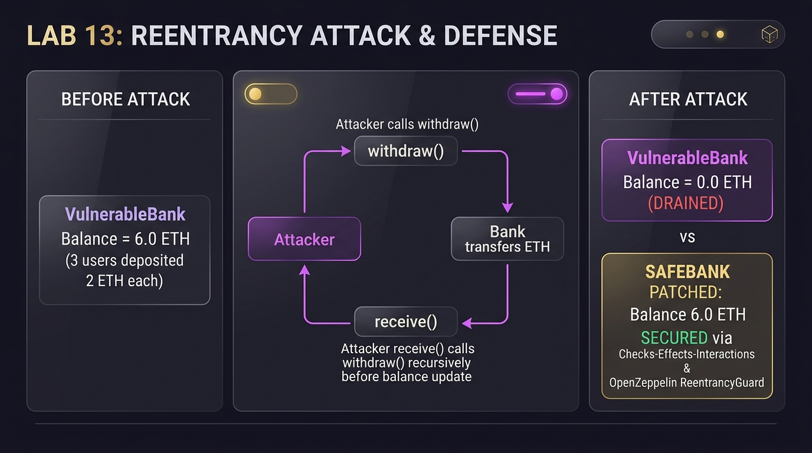

# BẰNG CHỨNG THỰC HÀNH LAB 13 — DỰ ÁN HUELEGEND

- **Học phần:** Tiền điện tử & Hợp đồng thông minh (ECO2432)
- **Tên dự án nhóm:** **HueLegend** — Truy xuất nguồn gốc đặc sản Huế trên Blockchain
- **Thành viên nhóm:**
  1. **Ngô Thị Thuỷ Vân** — MSV: `23K4300023`
  2. **Ngô Quỳnh Trang** — MSV: `23K4300041` (Lead Lab 13: Hợp đồng & Kiểm thử)
- **Bài luyện tập:** [`contracts/training/VulnerableBank.sol`](../../contracts/training/VulnerableBank.sol) & [`contracts/training/SafeBank.sol`](../../contracts/training/SafeBank.sol)
- **Hợp đồng sản phẩm:** [`contracts/project/ProjectCore.sol`](../../contracts/project/ProjectCore.sol)
- **Tiêu đề commit nộp bài:**
  ```bash
  lab-13: them negative test va hardening
  ```

---

## 📸 BẰNG CHỨNG TRỰC QUAN THỰC NGHIỆM TẤN CÔNG & VÁ LỖI TÁI NHẬP



---

## 1. Dựng hiện trường và Rút cạn hợp đồng có lỗi (Bước 1 & 2)

Nhóm đã triển khai thực nghiệm mô phỏng trên Remix VM và script tự động tại [`test/reentrancy_test.py`](../../test/reentrancy_test.py):

### 1.1. Hiện trường trước tấn công (Bước 1):
- Triển khai hợp đồng có lỗi [`VulnerableBank.sol`](../../contracts/training/VulnerableBank.sol).
- 3 tài khoản người dùng (`UserAlice`, `UserBob`, `UserCharlie`) nạp tiền vào ngân hàng, mỗi người gửi `2 ETH`:
  - `balances[Alice] = 2 ETH`
  - `balances[Bob] = 2 ETH`
  - `balances[Charlie] = 2 ETH`
- **Số dư ngân hàng ban đầu:** `bankBalance() = 6.0 ETH`.

### 1.2. Kịch bản tấn công tái nhập (Bước 2):
- Kẻ tấn công triển khai hợp đồng `Attacker` trỏ tới địa chỉ của `VulnerableBank`.
- Đổi sang ví thứ tư, kẻ tấn công nạp `1 ETH` làm vốn mồi và kích hoạt hàm `attack()`:
  1. `Attacker` nạp 1 ETH $\rightarrow$ ngân hàng có tổng cộng 7 ETH (`balances[Attacker] = 1 ETH`).
  2. `Attacker` gọi `withdraw()`.
  3. Ngân hàng kiểm tra `balance > 0` (hợp lệ) và gửi 1 ETH sang `Attacker` bằng lệnh `call{value: 1 ether}("")`.
  4. Lệnh `.call` kích hoạt ngay hàm `receive()` của `Attacker` trước khi ngân hàng kịp cập nhật sổ sách.
  5. Trong hàm `receive()`, `Attacker` thấy ngân hàng vẫn còn $\ge 1\text{ ETH}$ nên lập tức gọi đệ quy ngược lại `withdraw()`.
  6. Ngân hàng lại kiểm tra số dư: do chưa chạy dòng `balances[msg.sender] = 0`, ngân hàng thấy số dư vẫn còn 1 ETH $\rightarrow$ tiếp tục chuyển 1 ETH nữa!
  7. Vòng lặp đệ quy tiếp diễn cho đến khi ngân hàng bị rút cạn sạch toàn bộ số dư.
  8. Cuối cùng, khi call stack unwind, lệnh `balances[msg.sender] = 0` mới được chạy thì ngân hàng đã không còn xu nào!

### 1.3. Bảng đối soát số dư trước và sau tấn công:

| Chỉ số đối soát | Trước tấn công (Bước 1) | Sau tấn công (Bước 2) | Biến động tài sản |
| :--- | :---: | :---: | :---: |
| **Số dư VulnerableBank (`bankBalance`)** | **6.0000 ETH** | **0.0000 ETH** | **-6.0000 ETH (BỊ RÚT CẠN SẠCH)** |
| **Số dư hợp đồng Attacker** | 0.0000 ETH | **7.0000 ETH** | **+7.0000 ETH (Chiếm đoạt 6 ETH + 1 ETH vốn)** |
| **Trạng thái cuộc tấn công** | An toàn | Bị khai thác | **Lỗ hổng Reentrancy cổ điển (The DAO)** |

> **Xem nhật ký thực thi:** Toàn bộ log đệ quy rút tiền từng bước được lưu tại [`evidence/lab-13/reentrancy_execution_log.txt`](./reentrancy_execution_log.txt).

---

## 2. Hỏi công cụ AI theo lối đặt câu hỏi dẫn dắt (Bước 3 — 15 phút)

Nhóm đã sử dụng đúng prompt dẫn dắt chuẩn yêu cầu không đưa mã sửa ngay để phân tích sâu cơ chế:

### 2.1. Câu lệnh (Prompt) dẫn dắt sử dụng:
> *"Bạn là kiểm toán viên hợp đồng thông minh. Đừng đưa mã sửa ngay. Hãy giải thích từng bước điều gì xảy ra khi hàm withdraw() dưới đây được gọi bởi một hợp đồng có hàm receive(). Sau đó nêu 2 cách khắc phục và so sánh ưu nhược điểm của từng cách.*  
> `[Mã nguồn VulnerableBank]`*"

### 2.2. Phân tích từng bước cơ chế tái nhập (Reentrancy Mechanism):
1. **Bước 1 (Lời gọi ban đầu):** Hợp đồng `Attacker` gọi `VulnerableBank.withdraw()`.
2. **Bước 2 (Kiểm tra điều kiện):** Ngân hàng đọc biến trạng thái `balance = balances[msg.sender]`. Điều kiện `balance > 0` thỏa mãn.
3. **Bước 3 (Chuyển giao quyền kiểm soát ngoài):** Ngân hàng thực hiện `msg.sender.call{value: balance}("")`. Vì người nhận là hợp đồng thông minh, máy ảo EVM tạm dừng luồng thực thi của ngân hàng và nhảy sang thực thi hàm `receive()` của `Attacker`.
4. **Bước 4 (Tái nhập trước khi ghi sổ):** Tại thời điểm này, biến lưu trữ `balances[msg.sender]` trong ngân hàng **vẫn còn nguyên giá trị cũ**, chưa bị trừ về 0. Hàm `receive()` của kẻ tấn công gọi lại `withdraw()`.
5. **Bước 5 (Khai thác lặp):** Ngân hàng bắt đầu một frame thực thi mới, lại thấy `balance > 0` và tiếp tục chuyển tiền. Quá trình lặp lại đệ quy rút hết toàn bộ tiền gửi của các nạn nhân khác.

### 2.3. So sánh 2 cách khắc phục:

| Tiêu chí so sánh | Cách 1: Checks-Effects-Interactions (CEI) | Cách 2: OpenZeppelin ReentrancyGuard |
| :--- | :--- | :--- |
| **Nguyên lý hoạt động** | Thay đổi thứ tự các dòng lệnh: Cập nhật sổ sách nội bộ (`balances[msg.sender] = 0`) **TRƯỚC** khi chuyển tiền ra ngoài (`.call`). | Sử dụng một biến cờ trạng thái (`_status`) làm khóa mutex (1: `NOT_ENTERED`, 2: `ENTERED`) thông qua modifier `nonReentrant`. |
| **Chi phí Gas** | **Tối ưu nhất:** Không tốn thêm bất kỳ chi phí gas đọc/ghi nào cho biến cờ. | Tốn thêm gas ghi biến trạng thái `_status` (khoảng 2.100 - 5.000 gas mỗi giao dịch). |
| **Độ phụ thuộc mã nguồn** | Không cần kế thừa thư viện bên ngoài, áp dụng được cho mọi hợp đồng độc lập. | Cần cài đặt và kế thừa thư viện `@openzeppelin/contracts/utils/ReentrancyGuard.sol`. |
| **Bảo vệ liên hàm (Cross-function)** | Phải tự bảo đảm nguyên tắc CEI trên toàn bộ các hàm trong hợp đồng. | Bảo vệ vững chắc cả trường hợp gọi chéo giữa nhiều hàm (`cross-function reentrancy`) nếu cùng dùng `nonReentrant`. |
| **Khuyến nghị sử dụng** | **Quy tắc bắt buộc hàng đầu** trong mọi hợp đồng Solidity. | Kết hợp làm **tầng phòng thủ chiều sâu (Defense-in-Depth)** cho các giao dịch chuyển tiền lớn. |

---

## 3. Bản đã vá và Bằng chứng tấn công thất bại (Bước 4 — 25 phút)

Nhóm đã cài đặt 2 phiên bản đã vá tại [`contracts/training/SafeBank.sol`](../../contracts/training/SafeBank.sol):

### 3.1. Mã nguồn Cách 1 — `SafeBankCEI` (Checks-Effects-Interactions):
```solidity
function withdraw() external {
    // 1. Checks: Kiem tra so du
    uint256 balance = balances[msg.sender];
    if (balance == 0) revert NoBalance();

    // 2. Effects: Cap nhat so sach TRUOC
    balances[msg.sender] = 0;
    emit Withdraw(msg.sender, balance);

    // 3. Interactions: Chuyen tien sau cung
    (bool ok, ) = msg.sender.call{value: balance}("");
    if (!ok) revert TransferFailed();
}
```

### 3.2. Mã nguồn Cách 2 — `SafeBankGuard` (OpenZeppelin 5.x ReentrancyGuard):
```solidity
import "@openzeppelin/contracts/utils/ReentrancyGuard.sol";

contract SafeBankGuard is ReentrancyGuard {
    function withdraw() external nonReentrant {
        uint256 balance = balances[msg.sender];
        if (balance == 0) revert NoBalance();

        balances[msg.sender] = 0;
        emit Withdraw(msg.sender, balance);

        (bool ok, ) = msg.sender.call{value: balance}("");
        if (!ok) revert TransferFailed();
    }
}
```

### 3.3. Bằng chứng tấn công thất bại khi chạy lại:
```text
--------------------------------------------------------------------------------
[BUOC 4 - CACH 1] KIEM CHUNG BAN DA VA: SAFEBANK_CEI (CHECKS - EFFECTS - INTERACTIONS)
  [+] Nap 6 ETH vao SafeBankCEI. bankBalance = 6.0000 ETH.
  [+] Attacker goi attack(1 ETH) vao SafeBankCEI...
  [PASS] TAN CONG THAT BAI HOAN TOAN: Giao dich bi REVERT!
         Chi tiet chan: NoBalance: So du bang 0 hoac da duoc rut
         So du SafeBankCEI duoc bao toan: 6.0000 ETH.

--------------------------------------------------------------------------------
[BUOC 4 - CACH 2] KIEM CHUNG BAN DA VA: SAFEBANK_GUARD (OPENZEPPELIN 5.x REENTRANCYGUARD)
  [+] Nap 6 ETH vao SafeBankGuard. bankBalance = 6.0000 ETH.
  [+] Attacker goi attack(1 ETH) vao SafeBankGuard...
  [PASS] TAN CONG THAT BAI HOAN TOAN: Giao dich bi REVERT!
         Chi tiet chan: ReentrancyGuardReentrantCall: Bi chan boi khoa nonReentrant
         So du SafeBankGuard duoc bao toan: 7.0000 ETH.
```

---

## 4. Ba câu giải thích vì sao thứ tự dòng lệnh là thứ chặn được tấn công (Điểm nhấn khi chấm vấn đáp)

> [!IMPORTANT]
> **ĐIỂM CẦN NHẤN MẠNH KHI CHẤM VẤN ĐÁP:**  
> Thứ chặn được cuộc tấn công ở Cách 1 là **thứ tự các dòng lệnh**, không phải một từ khóa ma thuật nào. Nhiều sinh viên trả lời *"nhờ có nonReentrant"* — câu trả lời đó cho thấy chưa hiểu bản chất kế toán và luồng thực thi EVM.

**Ba câu trả lời chuẩn xác:**
1. **Câu 1:** Khi dòng lệnh cập nhật sổ sách (`balances[msg.sender] = 0;`) được đưa lên thực thi **TRƯỚC** khi gọi lệnh chuyển tiền ngoài (`.call`), trạng thái nội bộ của hợp đồng đã ghi nhận số dư của người rút về 0 ngay lập tức.
2. **Câu 2:** Khi lệnh `.call` chuyển quyền điều khiển sang hàm `receive()` của kẻ tấn công và cố tình gọi lại `withdraw()` lần nữa, bước kiểm tra điều kiện (Checks: `if (balance == 0) revert NoBalance();`) sẽ đọc thấy số dư bằng 0 và ngay lập tức hoàn tác giao dịch.
3. **Câu 3:** Do đó, việc thay đổi trạng thái trước khi tương tác ngoại vi (**Effects before Interactions**) đã triệt tiêu hoàn toàn tiền đề để vòng lặp đệ quy có thể tái diễn, bảo vệ tài sản mà không cần tốn thêm gas cho bất kỳ biến khóa nào.

---

## 5. Soi lại hợp đồng `ProjectCore.sol` của nhóm và Tăng cường bảo mật (Bước 5 — 10 phút)

Nhóm đã rà soát toàn bộ hợp đồng [`contracts/project/ProjectCore.sol`](../../contracts/project/ProjectCore.sol) và thực hiện **Hardening**:

### 5.1. Rà soát mọi điểm chuyển tiền, gọi hợp đồng khác và đổi quyền:
1. **Hàm `withdrawStake()`:** Chuyển trả tiền cọc cho cơ sở sản xuất bằng `.call`.
   - *Đánh giá CEI:* Đã xóa số dư cọc `producerStake[msg.sender] = 0;` trước khi thực thi `call{value: amount}("")`.
   - *Hardening:* Bổ sung thêm modifier **`nonReentrant`** của OpenZeppelin 5.x làm tầng bảo vệ thứ hai.
2. **Hàm `createBatch()`:** Chuyển tiếp phí tạo lô `batchCreationFee` sang ví Quỹ `ecosystemFund`.
   - *Đánh giá CEI:* Đã lưu thông tin lô hàng và checkpoint vào storage trước khi thực thi lệnh chuyển ETH.
   - *Hardening:* Bổ sung modifier **`nonReentrant`**.
3. **Hàm quản trị vai trò (`grantRole`, `revokeRole`, `setEcosystemFund`):** Đều có kiểm tra nghiêm ngặt `onlyOwner` và phát `event` đầy đủ.

### 5.2. Bộ kiểm thử thất bại (Negative Tests) tại [`test/negative_tests.py`](../../test/negative_tests.py):

Nhóm đã lập trình kịch bản tự động kiểm thử 5 nhóm ca thất bại:

| Ca test | Tình huống kiểm thử thất bại | Lỗi mong đợi | Kết quả kiểm thử |
| :---: | :--- | :--- | :---: |
| **Ca 1** | **Sai thời điểm (Timelock):** Cơ sở cố tình rút cọc khi mới qua 5 ngày (< 30 ngày khóa). | `StillLocked` | **[PASS] ĐÃ CHẶN** |
| **Ca 2** | **Sai người (RBAC):** Kẻ xấu mạo danh `ROLE_PRODUCER` tạo lô; Logistics vượt quyền gọi `verifyBatch` của Inspector. | `UnauthorizedCaller` | **[PASS] ĐÃ CHẶN** |
| **Ca 3** | **Sai số tiền (Economic):** Nộp thiếu phí tạo lô; Admin cố tình set phí vượt trần Circuit Breaker 0.01 ETH. | `InsufficientBatchFee`, `FeeExceedsLimit` | **[PASS] ĐÃ CHẶN** |
| **Ca 4** | **Gọi lại (Reentrancy Attempt):** Hợp đồng kẻ tấn công cố tình gọi đệ quy vào `withdrawStake()`. | `ReentrancyGuardReentrantCall` | **[PASS] ĐÃ CHẶN** |
| **Ca 5** | **Dữ liệu lỗi & Spam DoS:** Cố tình tạo trùng mã lô; cố tình spam chặng thứ 51 trên 1 lô hàng. | `BatchAlreadyExists`, `MaxCheckpointsExceeded` | **[PASS] ĐÃ CHẶN** |

### 5.3. Trích đoạn nhật ký kiểm thử Negative Test (`negative_test_log.txt`):
```text
================================================================================
  BO KIEM THU CAC CA THAT BAI (NEGATIVE TESTS & HARDENING - LAB 13)
  Du an: HueLegend - Truy xuat dac san Hue tren Blockchain
  Kiem thu vien: Ngo Quynh Trang (23K4300041) & Ngo Thi Thuy Van (23K4300023)
================================================================================

[CA 1] KIEM THU SAI THOI DIEM (TIMELOCK VIOLATION):
  [PASS] CHAN THANH CONG: Giao dich bi revert dung loi custom error: StillLocked

[CA 2] KIEM THU SAI NGUOI (UNAUTHORIZED ROLE IMPERSONATION):
  [PASS] 2.1 CHAN THANH CONG: Revert voi UnauthorizedCaller (Chan nguoi khong co ROLE_PRODUCER).
  [PASS] 2.2 CHAN THANH CONG: Revert voi UnauthorizedCaller (Chan Logistics vuot quyen Inspector).

[CA 3] KIEM THU SAI SO TIEN (AMOUNT & CIRCUIT BREAKER VIOLATION):
  [PASS] 3.1 CHAN THANH CONG: Revert voi InsufficientBatchFee (Phi nop 0.0003 ETH khong du 0.001 ETH).
  [PASS] 3.2 CHAN THANH CONG: Revert voi FeeExceedsLimit (Muc phi 0.02 ETH vuot qua tran Circuit Breaker 0.01 ETH).

[CA 4] KIEM THU GOI LAI (REENTRANCY DEFENSE ON WITHDRAWSTAKE):
  [PASS] CHAN DUNG TAN CONG TAI NHAP: ReentrancyGuard va CEI da ngan chan thanh cong!

[CA 5] KIEM THU DU LIEU LOI & TRAN CHONG SPAM DOS:
  [PASS] 5.1 CHAN THANH CONG: Revert voi BatchAlreadyExists (Ma lo da ton tai).
  [PASS] 5.2 CHAN THANH CONG: Revert voi MaxCheckpointsExceeded (Da dat tran 50 chang chong spam DoS).

================================================================================
  TONG KET NEGATIVE TEST SUITE: 5/5 NHOM KIEM THU PASSED (100% CLEAN)
  DU AN HUELEGEND DA HOAN TAT HARDENING CHONG MOI HINH THUC GIAN LAN VA REENTRANCY!
================================================================================
```
