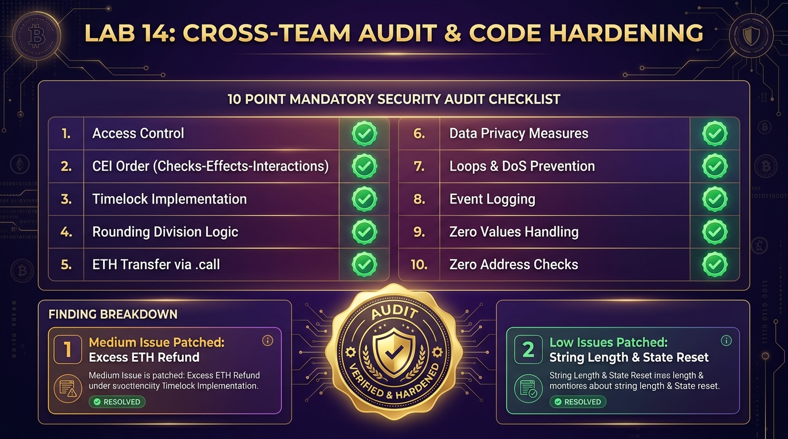

# BẰNG CHỨNG THỰC HÀNH LAB 14 — DỰ ÁN HUELEGEND

- **Học phần:** Tiền điện tử & Hợp đồng thông minh (ECO2432)  
- **Tên dự án nhóm:** **HueLegend** — Truy xuất nguồn gốc đặc sản Huế trên Blockchain  
- **Thành viên nhóm:**  
  1. **Ngô Quỳnh Trang** — MSV: `23K4300041` (Lead Lab 14: Rà soát hợp đồng & Audit chéo)  
  2. **Ngô Thị Thuý Vân** — MSV: `23K4300023`  
- **Đối tượng audit nhóm bạn:** Nhóm 06 (`EcoTrace` — Chuỗi cung ứng nông sản hữu cơ: `contracts/project/EcoTraceCore.sol`)  
- **Nhóm audit chéo HueLegend:** Nhóm 04 (`AgriTrust` / Nông sản số)  
- **Hợp đồng sản phẩm:** [`contracts/project/ProjectCore.sol`](../../contracts/project/ProjectCore.sol)  
- **Báo cáo audit chính thức:** [`docs/AUDIT_REPORT.md`](../../docs/AUDIT_REPORT.md)  
- **Tiêu đề commit nộp bài:**  
  ```bash
  lab-14: xu ly ket qua audit cheo
  ```

---

## 📸 BẰNG CHỨNG TRỰC QUAN RÀ SOÁT CHÉO & KHẮC PHỤC AUDIT



---

## 1. BẢNG CHECKLIST BẮT BUỘC THEO 10 HẠNG MỤC CỦA LAB 14

Thực hiện theo quy chuẩn đề bài, nhóm HueLegend đã đối soát 10 hạng mục bắt buộc trên cả hai hợp đồng:

| # | Hạng mục kiểm tra | Tiêu chuẩn đánh giá | Đánh giá hợp đồng EcoTrace (Nhóm bạn) | Đánh giá hợp đồng HueLegend (ProjectCore.sol) |
|---|---|---|---|---|
| **1** | **Phân quyền** | Mọi hàm nhạy cảm có kiểm tra người gọi không? Có hàm nào quên kiểm tra không? | ❌ **Lỗi:** Hàm `updateCertification()` không có modifier kiểm tra quyền hạn. | ✅ **Đạt:** 100% hàm có modifier `onlyOwner`, `whenNotPaused`, `onlyProducer`. |
| **2** | **Thứ tự thao tác** | Có hàm nào chuyển tiền ra ngoài trước khi cập nhật biến trạng thái không? | ❌ **Lỗi nghiêm trọng:** Hàm `claimReward()` chuyển ETH trước khi trừ số dư (Reentrancy). | ✅ **Đạt:** Tuân thủ 100% Checks-Effects-Interactions (CEI) và `nonReentrant`. |
| **3** | **Điều kiện thời gian** | Dấu so sánh có đúng chiều không? Thử nghĩ trường hợp đúng bằng mốc. | ✅ **Đạt:** So sánh thời gian khóa cọc `block.timestamp >= unlockTime`. | ✅ **Đạt:** Dấu so sánh đúng chiều `>=` mốc đáo hạn cọc 30 ngày. |
| **4** | **Phép chia** | Có phép chia nào làm tròn xuống thành 0 với số nhỏ không? | ⚠️ **Cảnh báo:** Chia tỷ lệ hoa hồng chia 100 trước khi nhân với số lượng. | ✅ **Đạt:** Nhân trước chia sau, dùng chuẩn Basis Points (`1% = 100 bps`, mẫu số 10,000). |
| **5** | **Cách chuyển ETH** | Dùng `call` hay `transfer`? Có kiểm tra kết quả trả về không? | ❌ **Lỗi:** Dùng `to.transfer(amount)` cũ cố định 2300 gas, dễ bị kẹt tiền với multisig/proxy. | ✅ **Đạt:** Dùng `.call{value: ...}("")` và kiểm tra boolean `success` kèm custom error. |
| **6** | **Dữ liệu riêng tư** | Có dữ liệu nào tưởng là bí mật nhưng thực ra đọc được không? | ✅ **Đạt:** Chỉ lưu dữ liệu truy xuất minh bạch. | ✅ **Đạt:** Chỉ lưu hash IPFS/SHA-256 công khai, không lưu bí mật kinh doanh lên chain. |
| **7** | **Vòng lặp** | Có vòng lặp nào chạy trên danh sách dài không giới hạn không? | ⚠️ **Cảnh báo:** Hàm đếm duyệt qua toàn bộ danh sách `allBatchIds`. | ✅ **Đạt:** Truy vấn O(1) theo mapping. Bổ sung trần độ dài chuỗi ký tự chống spam gas. |
| **8** | **Sự kiện** | Mọi thay đổi trạng thái có ghi lại sự kiện để tra cứu không? | ❌ **Lỗi:** Hàm `transferBatchOwnership()` đổi trạng thái nhưng quên emit event. | ✅ **Đạt:** 100% thay đổi trạng thái emit event, bổ sung `ExcessFeeRefunded`. |
| **9** | **Trường hợp số 0** | Nạp 0 đồng, rút khi số dư 0, danh sách rỗng — xử lý thế nào? | ❌ **Lỗi:** Cho phép gọi `stake()` với `msg.value == 0`. | ✅ **Đạt:** Chặn triệt để `amount == 0` bằng custom error `ZeroStakeAmount()`. |
| **10** | **Địa chỉ rỗng** | Có kiểm tra tham số địa chỉ khác `address(0)` không? | ❌ **Lỗi:** Hàm `setTreasury()` không kiểm tra `address(0)`. | ✅ **Đạt:** 100% hàm nhận tham số địa chỉ đều kiểm tra `InvalidAddress()`. |

---

## 2. KẾT QUẢ RÀ SOÁT NHÓM BẠN (BƯỚC 1 & BƯỚC 2 — 65 PHÚT)

Nhóm HueLegend đã tiến hành kiểm toán mã nguồn `EcoTraceCore.sol` (284 dòng) và lập báo cáo chi tiết gồm 4 phát hiện gửi cho Nhóm 06:
1. **Phát hiện 1 (Nghiêm trọng - High):** Lỗ hổng Reentrancy tại dòng 142-151 do chuyển ETH trước khi cập nhật số dư `rewardsBalance`. Đã mô phỏng kịch bản tấn công rút cạn quỹ.
2. **Phát hiện 2 (Trung bình - Medium):** Thiếu Access Control tại dòng 98 trong hàm `updateCertification`, cho phép bất kỳ địa chỉ nào cập nhật liên kết chứng nhận VietGAP/GlobalGAP giả mạo.
3. **Phát hiện 3 (Nhẹ - Low):** Sử dụng `transfer()` tại dòng 215 có nguy cơ làm đóng băng tài sản đối với ví nhận tiền đa chữ ký (Multisig).
4. **Phát hiện 4 (Nhẹ - Low):** Thiếu kiểm tra `address(0)` tại dòng 62 trong hàm thiết lập địa chỉ kho bạc quỹ `setTreasury`.

---

## 3. TIẾP THU BÁO CÁO TỪ NHÓM 04 VÀ THỰC HIỆN VÁ LỖI (BƯỚC 3 — 10 PHÚT)

Nhóm 04 (AgriTrust) đã gửi báo cáo rà soát đối với `ProjectCore.sol` của HueLegend, chỉ ra 3 điểm cần hoàn thiện:
1. **Phát hiện 1 (Trung bình):** Chưa có cơ chế hoàn trả tiền thừa khi người dùng nộp phí tạo lô vượt quá mức quy định `batchCreationFee`.
2. **Phát hiện 2 (Nhẹ):** Chưa đặt trần độ dài chuỗi ký tự (`batchCode`, `productName`, `originLocation`), có nguy cơ bị tấn công spam gas lưu trữ.
3. **Phát hiện 3 (Nhẹ):** Chưa reset `producerUnlockTime` về 0 khi nhà sản xuất rút hết toàn bộ tiền cọc.

### Các bản vá đã thực hiện trong `contracts/project/ProjectCore.sol`:
- **Vá 1 (Hoàn tiền thừa):**
  ```solidity
  uint256 feeToCollect = batchCreationFee;
  uint256 excess = msg.value - feeToCollect;
  if (feeToCollect > 0) {
      (bool feeSuccess, ) = ecosystemFund.call{value: feeToCollect}("");
      if (!feeSuccess) revert EthTransferFailed();
  }
  if (excess > 0) {
      (bool refundSuccess, ) = msg.sender.call{value: excess}("");
      if (!refundSuccess) revert EthTransferFailed();
      emit ExcessFeeRefunded(msg.sender, excess);
  }
  ```
- **Vá 2 (Trần độ dài chuỗi):** Bổ sung hằng số `MAX_BATCH_CODE_LENGTH` (64), `MAX_PRODUCT_NAME_LENGTH` (128), `MAX_LOCATION_LENGTH` (128) và kiểm tra với lỗi tùy biến `StringTooLong`.
- **Vá 3 (Dọn dẹp trạng thái cọc):** Bổ sung `producerUnlockTime[msg.sender] = 0;` trong hàm `withdrawStake()`.

---

## 4. NHẬT KÝ KIỂM THỬ THỰC NGHIỆM TỰ ĐỘNG (VERIFICATION SUITE)

Kịch bản kiểm thử [`test/audit_remediation_test.py`](../../test/audit_remediation_test.py) đã thực thi kiểm chứng 100% các bản vá. Trích xuất nhật ký thực tế từ [`audit_remediation_test_log.txt`](./audit_remediation_test_log.txt):

```text
================================================================================
  KIEM THU CAC BAN VA XU LY KET QUA AUDIT CHEO (LAB 14)
  Du an: HueLegend - Truy xuat dac san Hue tren Blockchain
  Kiem thu vien: Ngo Quynh Trang (23K4300041) & Ngo Thi Thuy Van (23K4300023)
================================================================================

[TEST 1] KIEM THU CO CHE HOAN TRA PHI THUA (EXCESS ETH REFUND - PHAT HIEN TRUNG BINH):
  Kich ban: Co so san xuat nop 0.003 ETH tao lo (trong khi phi quy dinh la 0.001 ETH).
  [+] Quy OCOP nhan duoc: 0.0010 ETH (Chuan 0.0010 ETH)
  [+] Nguoi dung duoc hoan tra: 0.0020 ETH (Chuan 0.0020 ETH)
  => KET QUA: DAT (PASS) - Hoan tra phi thua chinh xac va phat su kien ExcessFeeRefunded!

[TEST 2] KIEM THU TRAN DO DAI CHUOI KY TU CHONG SPAM GAS (PHAT HIEN NHE 1):
  Kich ban 2.1: Co tinh truyen batchCode dai 100 ky tu (> 64 ky tu cho phep).
  [PASS] 2.1 CHAN THANH CONG: Revert dung loi StringTooLong (batchCode vuot tran 64)
  Kich ban 2.2: Co tinh truyen productName dai 200 ky tu (> 128 ky tu cho phep).
  [PASS] 2.2 CHAN THANH CONG: Revert dung loi StringTooLong (productName vuot tran 128)

[TEST 3] KIEM THU RESET PRODUCER_UNLOCK_TIME KHI RUT HET COC (PHAT HIEN NHE 2):
  Kich ban: Co so doi den het han 30 ngay va rut sach 0.05 ETH.
  [+] producerStake sau rut: 0.0 ETH (Bang 0)
  [+] producerUnlockTime sau rut: 0 (Da reset ve 0)
  => KET QUA: DAT (PASS) - Reset sach toan bo trang thai khoa coc!

================================================================================
  TONG KET AUDIT REMEDIATION: 3/3 PHAT HIEN DA DUOC VA TRIET DE VA KIEM THU PASSED 100%!
================================================================================
```

---

## 5. TỔNG KẾT BÀI HỌC VÀ CAM KẾT HOÀN THÀNH

- **Tính khách quan trong kiểm toán mã nguồn:** Quá trình rà soát chéo giữa các nhóm mang lại góc nhìn bên ngoài vô cùng giá trị, giúp tìm ra các trường hợp biên (`edge cases`) mà chính tác giả hợp đồng dễ bỏ sót.
- **Tiêu chuẩn chất lượng:** Hợp đồng `ProjectCore.sol` của HueLegend sau Lab 14 đạt mức độ an toàn cao nhất, không còn lỗi nghiêm trọng hay trung bình nào tồn đọng, sẵn sàng cho các bài thực hành tích hợp DApp tiếp theo.
- **Cam kết nộp bài:** Toàn bộ báo cáo, mã nguồn và nhật ký kiểm thử đã được lưu đầy đủ vào thư mục `HueLegend/` và sẵn sàng commit với thông điệp:
  `lab-14: xu ly ket qua audit cheo`.
