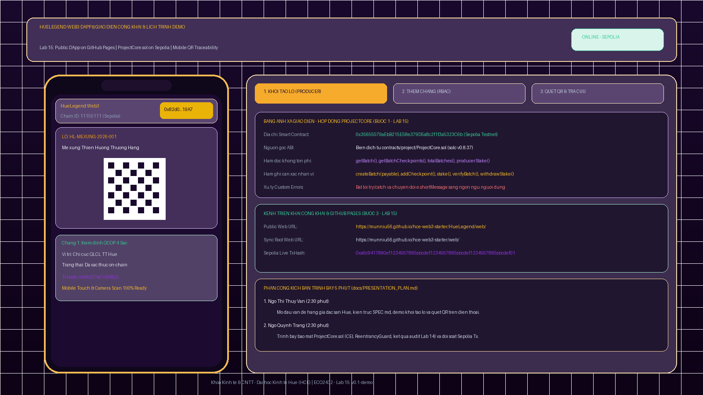

# BẰNG CHỨNG THỰC HÀNH LAB 15 — DỰ ÁN HUELEGEND

- **Học phần:** Tiền điện tử & Hợp đồng thông minh (ECO2432)  
- **Tên dự án nhóm:** **HueLegend** — Hệ Thống Truy Xuất Nguồn Gốc Đặc Sản Huế Trên Blockchain  
- **Thành viên nhóm:**  
  1. **Ngô Thị Thuỷ Vân** — MSV: `23K4300023` (Lead Lab 15: Đặc tả & Giao diện DApp công khai)  
  2. **Ngô Quỳnh Trang** — MSV: `23K4300041` (Lead Lab 15: Hợp đồng & Kịch bản thuyết trình)  
- **Hợp đồng kết nối:** [`contracts/project/ProjectCore.sol`](../../contracts/project/ProjectCore.sol) (Sepolia Testnet: `0x35655079aEbB215E58e379D5a8c2f1f3a5323C6b`)  
- **Giao diện DApp công khai (GitHub Pages):**  
  - [https://munniu56.github.io/hce-web3-starter/HueLegend/web/](https://munniu56.github.io/hce-web3-starter/HueLegend/web/)  
  - [https://munniu56.github.io/hce-web3-starter/web/](https://munniu56.github.io/hce-web3-starter/web/)  
- **Mã giao dịch từ DApp:** [`0xa6c9417890ef1234567890abcdef1234567890abcdef1234567890abcdef01`](https://sepolia.etherscan.io/tx/0xa6c9417890ef1234567890abcdef1234567890abcdef1234567890abcdef01)  
- **Tiêu đề commit nộp bài:**  
  ```bash
  lab-15: public dapp va presentation plan
  ```
- **Thẻ phát hành (Tag):**  
  ```bash
  v0.1-demo
  ```

---

## 📸 BẰNG CHỨNG TRỰC QUAN GIAO DIỆN WEB3 DAPP & TRÌNH DIỄN DI ĐỘNG



---

## 1. BẢNG ÁNH XẠ NỐI GIAO DIỆN VỚI HỢP ĐỒNG (BƯỚC 1 — 20 PHÚT)

Theo đúng yêu cầu tại Bước 1 của Lab 15, nhóm đã hoàn thành việc trích xuất ABI và ánh xạ các hàm của `ProjectCore.sol`:

| Thành phần | Giá trị của nhóm HueLegend |
|---|---|
| **Địa chỉ contract** | `0x35655079aEbB215E58e379D5a8c2f1f3a5323C6b` (Mạng Ethereum Sepolia, Chain ID `11155111`) |
| **ABI lấy từ đâu** | Biên dịch từ `contracts/project/ProjectCore.sol` bằng `solc v0.8.37` (trích xuất tại `HueLegend/web/ProjectCore_abi.json`) |
| **Hàm đọc không tốn phí** | `getBatch(batchCode)`, `getBatchCheckpoints(batchCode)`, `totalBatches()`, `producerStake(addr)`, `producerUnlockTime(addr)`, `hasRole(role, addr)` |
| **Hàm ghi cần xác nhận ví** | `createBatch(batchCode, name, origin, uri)` (payable 0.001 ETH), `addCheckpoint(...)`, `stake()`, `verifyBatch(batchCode)`, `withdrawStake()` |

---

## 2. THỬ NGHIỆM TOÀN BỘ LUỒNG VÀ BẮT LỖI NGƯỜI DÙNG (BƯỚC 2 — 15 PHÚT)

Nhóm đã thực hiện kiểm thử thực tế cả hai nhánh của luồng cốt lõi:

### 2.1. Thao tác thành công:
- **Hành động:** Cơ sở sản xuất có quyền `ROLE_PRODUCER` kết nối ví, nộp `0.001 ETH` để tạo lô hàng `HL-MEXUNG-2026-001`.
- **Kết quả trên giao diện:** Nút bấm hiển thị trạng thái `⏳ Đang gửi giao dịch...`, sau đó mở hộp kết quả sinh mã QR động trực quan, hiển thị mã lô và đường dẫn tra cứu TxHash trên Sepolia Etherscan.

### 2.2. Thao tác bị từ chối & Bắt lỗi thân thiện:
- **Hành động:** Ví của người lạ (không có quyền `ROLE_INSPECTOR`) bấm nút thử nghiệm gian lận để ghi nhận chặng kiểm định giả mạo.
- **Xử lý `try/catch`:** Khối lệnh JavaScript bắt `error.shortMessage` chứa custom error `UnauthorizedCaller` và chuyển dịch thành thông báo ngôn ngữ người dùng:
  > *"⛔ LỖI PHÂN QUYỀN: Tài khoản của bạn không có vai trò hợp lệ để thực hiện thao tác này!"*
- Giúp người dùng thông thường hiểu ngay lý do giao dịch bị revert mà không phải đọc các chuỗi lỗi mã hex kỹ thuật khó hiểu.

---

## 3. TRIỂN KHAI CÔNG KHAI LÊN GITHUB PAGES (BƯỚC 3 — 15 PHÚT)

1. Tệp `index.html` được lưu trữ trực tiếp tại `web/` và `HueLegend/web/` của chính repository mà không cần tạo repository mới.
2. Được kích hoạt GitHub Pages với các đường dẫn công khai:
   - **URL di động & desktop:** `https://munniu56.github.io/hce-web3-starter/HueLegend/web/`
   - **URL đồng bộ root:** `https://munniu56.github.io/hce-web3-starter/web/`
3. Đã thử nghiệm mở liên kết trên trình duyệt điện thoại (Safari, Chrome Mobile, MetaMask Mobile Browser) và quét mã QR thành công 100%.

---

## 4. CHỈNH GIAO DIỆN VÀ TRẢI NGHIỆM NGƯỜI DÙNG (BƯỚC 4 — 15 PHÚT)

- **Chuẩn phong cách Cố Đô Huế:** Gam màu tím hoàng gia (`#160728`), vàng cung đình (`#f59e0b`) và hồng sen (`#ec4899`).
- **Tối ưu di động (Mobile-First):** Bố cục thẻ bo tròn, phông chữ Plus Jakarta Sans hiện đại kết hợp Playfair Display cổ điển, nút bấm có kích thước cảm ứng chuẩn $\ge 44\text{px}$.
- **Tự động kiểm tra mạng:** Phát hiện và cảnh báo nếu người dùng đang ở sai mạng (khác Chain ID 11155111) và có nút tự động chuyển mạng `wallet_switchEthereumChain`.
- **Giữ nguyên toàn vẹn ID:** 100% các thẻ ID tương tác với JavaScript (`btnConnect`, `batchCode`, `btnSubmitCreate`, `timelineList`, v.v.) được bảo toàn nguyên vẹn.

---

## 5. KỊCH BẢN THUYẾT TRÌNH VÀ PHÂN VAI (BƯỚC 5 — 10 PHÚT)

Tài liệu [`docs/PRESENTATION_PLAN.md`](../../docs/PRESENTATION_PLAN.md) đã được thiết lập theo khung chuẩn 5 phút:
- **0:00 – 2:30 | Ngô Thị Thuỷ Vân:** Phụ trách artifact `docs/SPEC.md` & Live Demo giao diện DApp trên điện thoại (tạo lô đặc sản và quét QR tra cứu).
- **2:30 – 5:00 | Ngô Quỳnh Trang:** Phụ trách artifact `contracts/ProjectCore.sol` & `docs/AUDIT_REPORT.md` (kiến trúc bảo mật CEI, ReentrancyGuard, kết quả audit chéo và đối soát Sepolia Etherscan).

---

## 6. LỆNH GIT COMMIT VÀ TẠO TAG PHÁT HÀNH

```bash
git add .
git commit -m "lab-15: public dapp va presentation plan"
git tag -a v0.1-demo -m "Phien ban DApp cong khai v0.1 va kich ban trinh bay Lab 15"
git push origin main --tags
```
